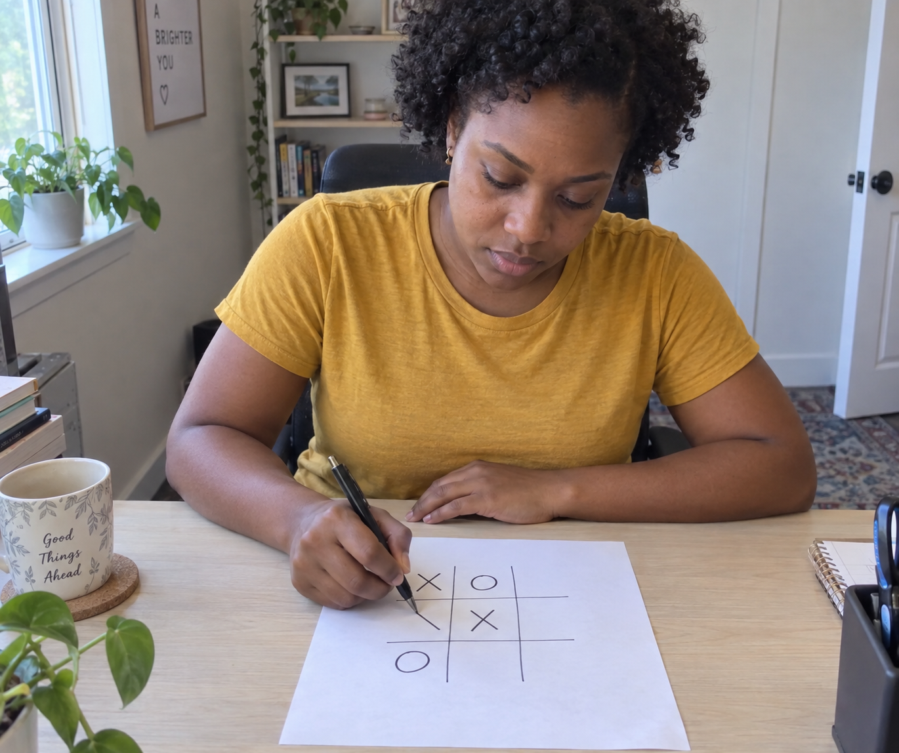
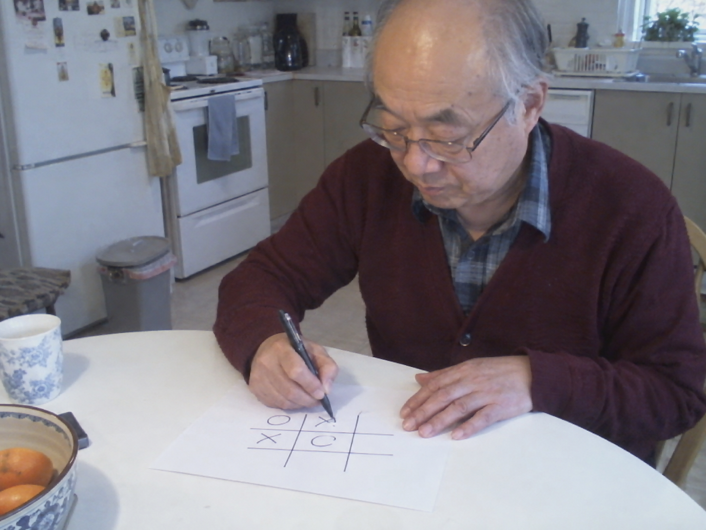
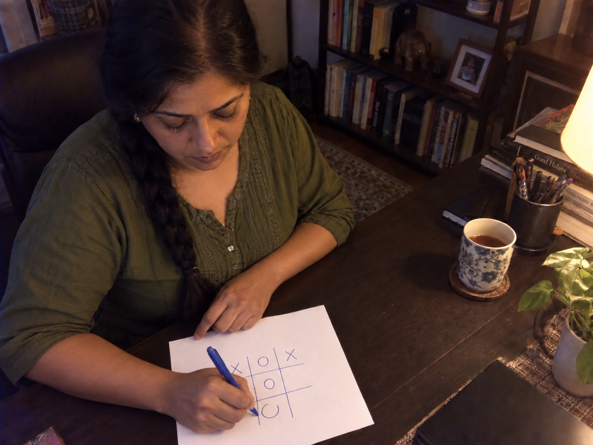
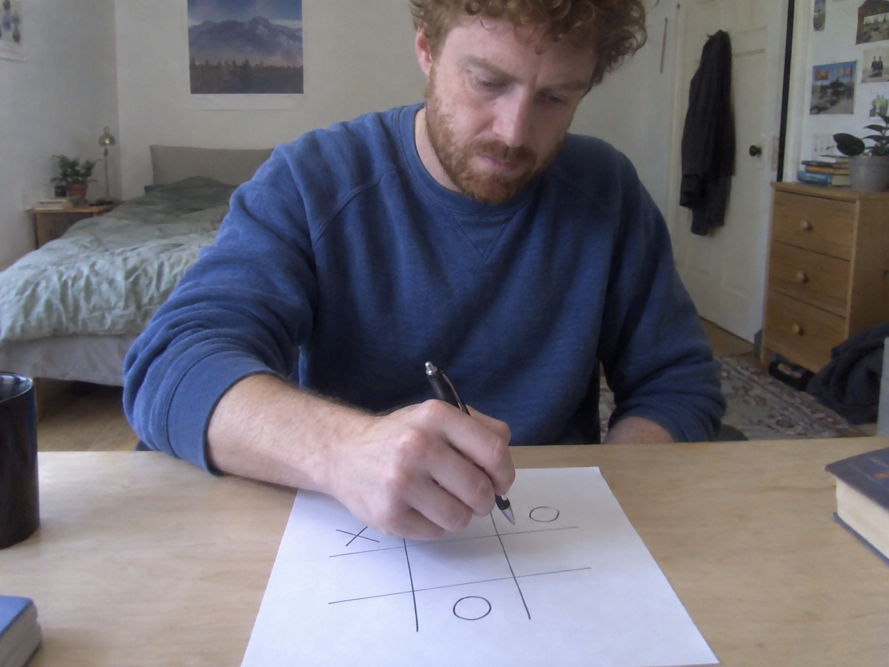
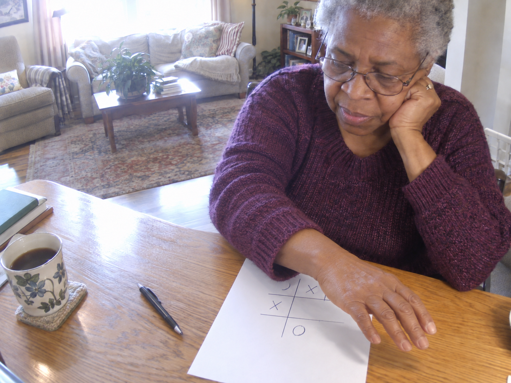
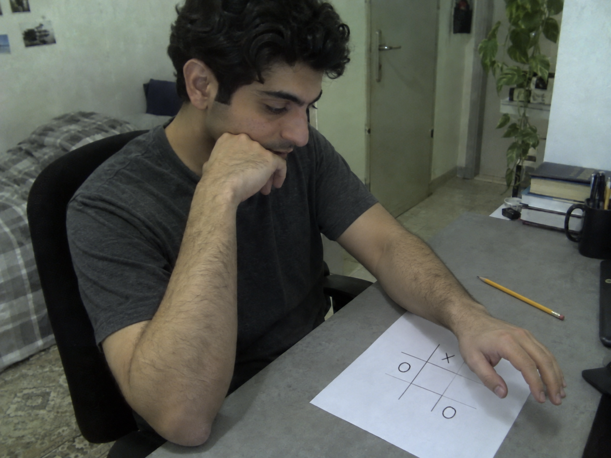
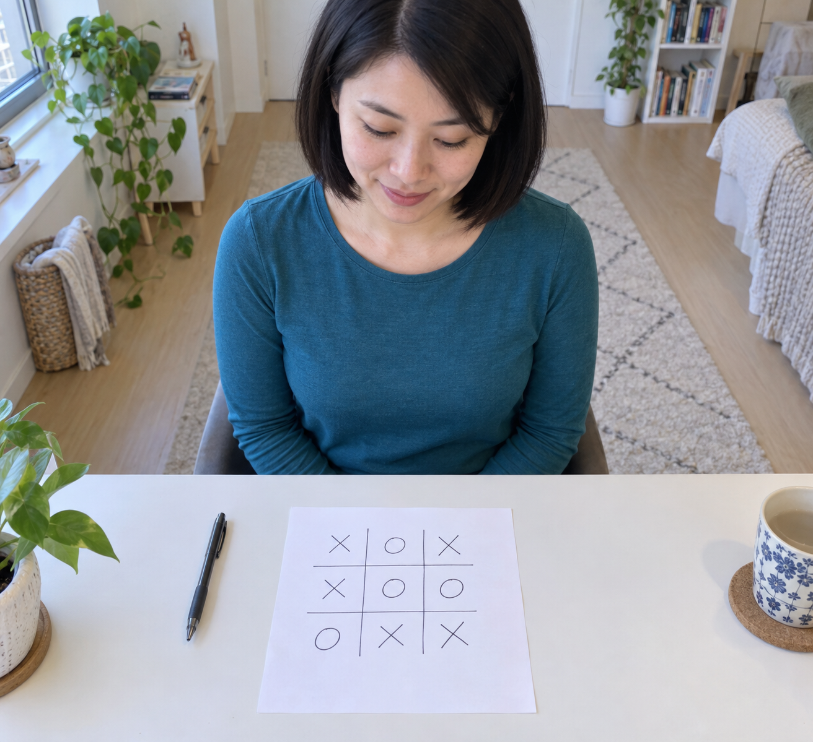
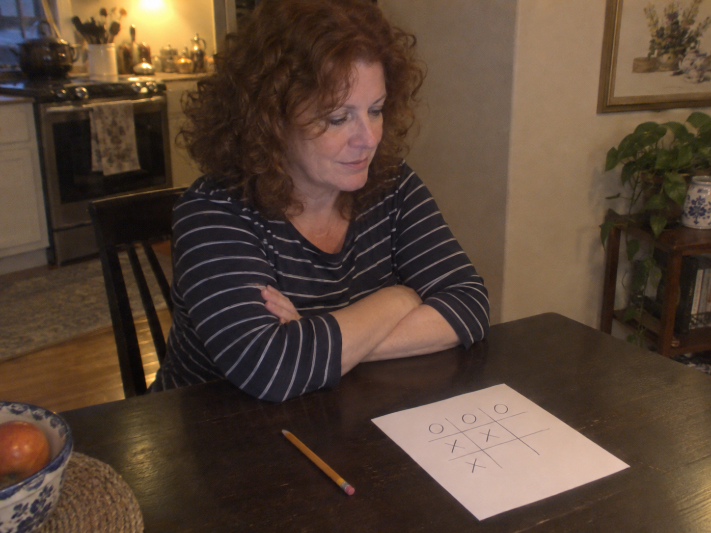
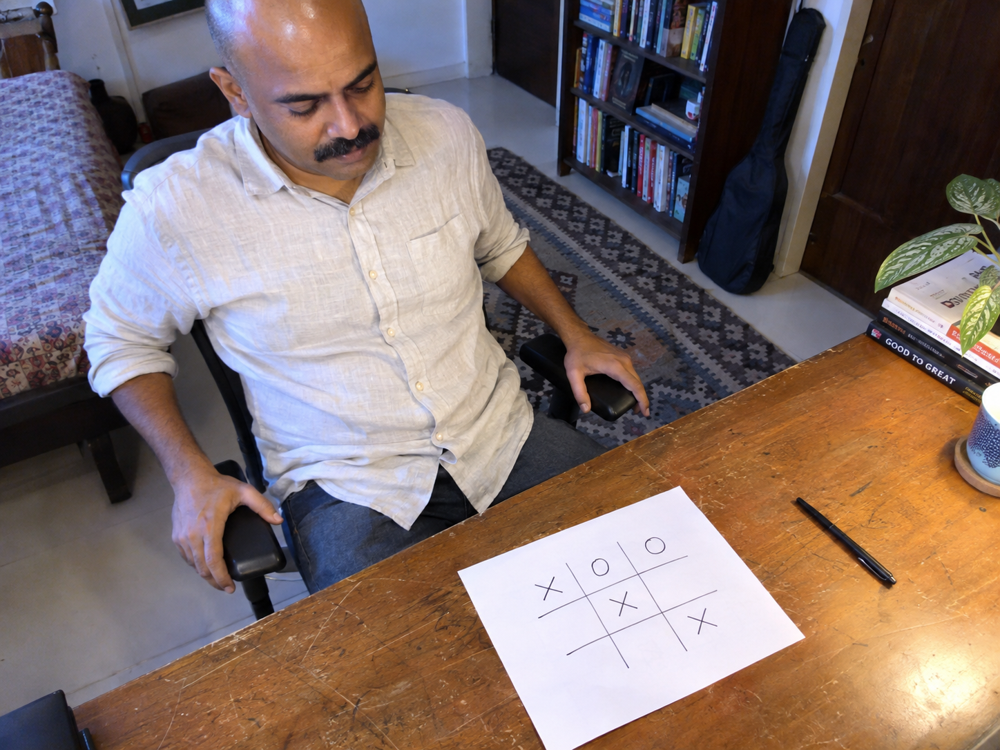
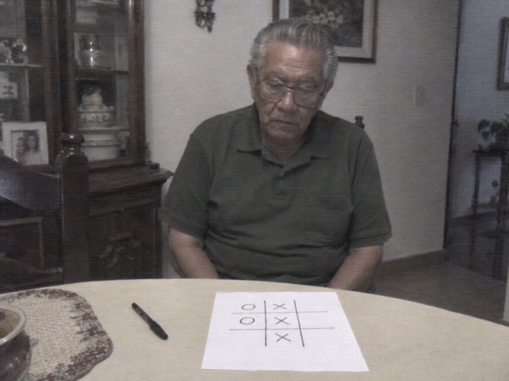

# Webcam tic-tac-toe image set

Ten separate AI-generated images made with the built-in image generation tool.

- 01–03: drawing
- 04–06: hovering arm partly obscures the game
- 07–10: finished drawing, board fully visible

Each image uses a different person, viewpoint, game position and webcam quality treatment.

Full generation and revision prompts are in [prompts.json](prompts.json). Quality labels describe the simulated webcam appearance; native dimensions are recorded separately.

## 01-drawing

## 02-drawing

## 03-drawing

## 04-hovering

## 05-hovering

## 06-hovering

## 07-finished

## 08-finished

## 09-finished

## 10-finished

